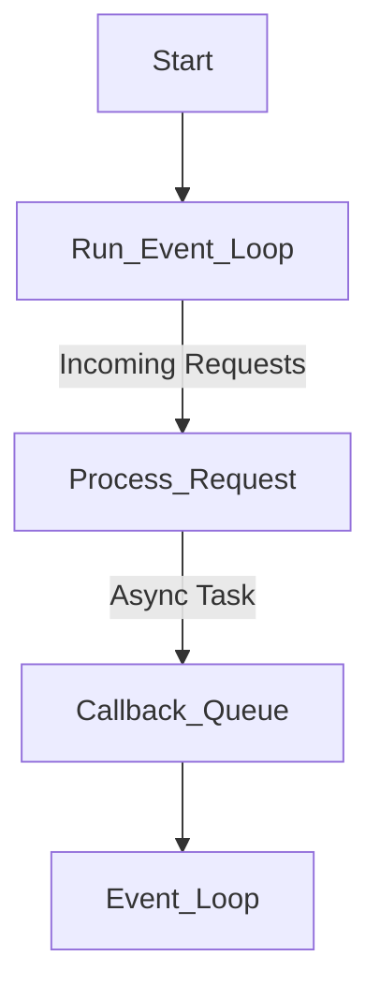
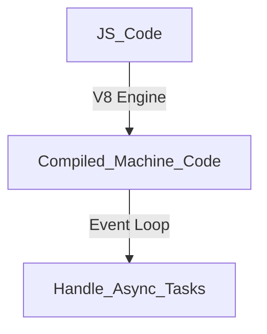

# 1. Understanding the Basics

tags: #NodeJS #Backend #JavaScript #EventLoop #Networking

---

## **How the Web Works**
The web operates through a request-response cycle between clients (browsers) and servers.
- **Clients** send HTTP requests.
- **Servers** process requests and send responses.
- **APIs** allow data exchange between client and server.

---

## **Creating a Node Server**
Node.js enables us to create lightweight, efficient web servers.

```js
const http = require('http');

const server = http.createServer((req, res) => {
  res.writeHead(200, { 'Content-Type': 'text/plain' });
  res.end('Hello, World!');
});

server.listen(3000, () => console.log('Server running on port 3000'));
```

---

## **The Node Lifecycle & Event Loop**
Node.js is event-driven and uses a single-threaded, non-blocking architecture.



---

## **Controlling the Node.js Process**
Use `process` object to manage execution.

```js
process.on('exit', (code) => {
  console.log(`Process exiting with code: ${code}`);
});
```

---

## **Understanding the Requests**
Requests contain method, URL, headers, and body.

```js
const server = http.createServer((req, res) => {
  console.log(req.method, req.url);
  res.end('Received request');
});
```

---

## **Sending Responses**
Responses include status codes, headers, and body.

```js
res.writeHead(200, { 'Content-Type': 'application/json' });
res.end(JSON.stringify({ message: 'Success' }));
```

---

## **Request & Response Headers**
Headers provide metadata for requests and responses.

```js
console.log(req.headers);
res.setHeader('X-Custom-Header', 'MyValue');
```

---

## **Routing Requests**
Differentiate requests based on URL and method.

```js
const server = http.createServer((req, res) => {
  if (req.url === '/' && req.method === 'GET') {
    res.end('Home Page');
  } else if (req.url === '/about' && req.method === 'GET') {
    res.end('About Page');
  } else {
    res.writeHead(404);
    res.end('Not Found');
  }
});
```

---

## **Parsing Request Bodies**
Handling incoming data from clients.

```js
let body = '';
req.on('data', chunk => {
  body += chunk.toString();
});
req.on('end', () => {
  console.log('Body:', body);
  res.end('Received Data');
});
```

---

## **Understanding Event Driven Code Execution**
Node.js runs event-driven, executing non-blocking code first.

```js
console.log('Start');
setTimeout(() => console.log('Timeout!'), 0);
console.log('End');
```

---

## **Blocking and Non-Blocking Code**
Blocking code stops execution, while non-blocking code allows other tasks to run.

```js
const fs = require('fs');

// Blocking (Synchronous)
const data = fs.readFileSync('file.txt', 'utf-8');
console.log(data);

// Non-Blocking (Asynchronous)
fs.readFile('file.txt', 'utf-8', (err, data) => {
  console.log(data);
});
```

---

## **Node.js - Looking Behind the Scenes**
Node.js runs JavaScript using the V8 engine and handles async tasks via the Event Loop.



---

## **Using the Node Modules System**
Node.js uses a modular system to organize code.

```js
// utils.js
module.exports = function add(a, b) {
  return a + b;
};

// main.js
const add = require('./utils');
console.log(add(2, 3));
```

---

## **Summary**
- Node.js enables efficient, non-blocking server-side development.
- Uses the Event Loop to handle asynchronous operations.
- Works with HTTP to handle requests and responses.
- Supports modular development via CommonJS.

This chapter introduces the fundamental concepts of Node.js, preparing us for more advanced topics.
